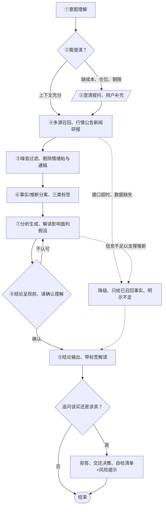

# 看懂你的自选股 · 产品与交互方案说明（PRD · MVP）

> 版本 V0.2（2026-09-09）· 本文档由交付包 `ai-touyan-assistant-prd.html` 转为 Markdown 入库，原 HTML 归档于同目录。
> 已按评测方案 V0.2 的两处裁定回改（文内以 ✎ 标注）；开源版维护本文件，与原型/评测方案的口径差异以本文件与 `eval-plan.md` 为准。

## 一 为谁做，不为谁做

**核心用户**：有真实持仓、缺投研背景的普通投资者，读不懂专业表述，分不清哪些信息真影响持仓。

**不服务三类人**：

- 短线投机者，节奏是"事件→解读"而非盘中信号；
- 要荐股结论者，买卖结论触碰投顾红线；
- 无持仓浏览者，解读须锚定"你的持仓"。

## 二 一个场景：凌晨的公告

周三深夜，自选股的 M 公司突发公告：拟收购海外资产、构成重大重组。推送是过滤后的事实摘要：发生了什么、涉及自选哪些公司。

点开问："这对我持仓意味着什么？"助手先问：成本？占总资产比？期限？再解读：公告原文【事实】；对业务的可能影响【推断·假设审批顺利】——你占比 18%、期限偏长，此项重组不确定性对你的影响高于多数持有人；股吧恐慌帖【噪音·已过滤】。

追问"该买还是该卖？"它不给结论，递自检清单：买、卖、持有的理由？——决定只能你做。

## 三 痛点与定位

**痛点**：资讯只推不消化；用户读不懂、分不清，多数放弃分析凭直觉。

**一句话定位**：围绕自选股做噪音过滤+可解释解读，看清"发生了什么、与我何干"，不做买卖决定。

### 成立与否的判断依据

- **为何解读而非荐股**：用户缺的不是结论而是理解，结论会过期、理解可复用；荐股把决策责任转嫁产品，出错即信任崩塌，监管红线不容。
- **为何现在成立**：编辑筛选与规则推送无法按每个人持仓个性化、无法多轮澄清、无法把公告翻成"与我何干"，大模型对话让个性化过滤+白话翻译首次可规模化，行情公告接口提供锚点；模型会幻觉，倒逼标签体系。
- **证伪条件**：带标签解读的用户留存持续不优于纯推送，或解读会话中追问买卖占比居高不下，即判定定位不成立并止损。

## 四 处理路径与人机协作

**图 1：从提问到结论的处理路径**（米色=AI，暖色=用户参与，灰虚线=降级）

> 注：⑥ 节点文案沿用原文「三类标签」；V0.2 标签体系实为四类，【噪音】为已过滤、不进结论，进入结论主体的仍是三类（事实/推断/未知）。

**个性化输入**：自选股决定"与我何干"的锚点，历史浏览记录决定解释的深浅——据此判断你对概念的熟悉层级，新手补术语解释，老手不啰嗦。

### 三个 HITL 节点

1. **澄清**——成本、仓位、期限决定"与你何干"，AI 不得替你假设，仅在缺失会改变结论方向时停下问；
2. **结论呈现前**——仅在推断占比高或涉及利空时请确认逻辑（跳过需记录跳过率）；
3. **追问"该买还是该卖"**——拒答交还决策：给自检清单+风险提示，坚持追问则再次引导，仍坚持即停止作答。

理由：触碰投顾红线、决策责任在用户、代决断扼杀判断力。

### 标签体系

- 【事实】已发生、有信源，必附信源与时间点；
- 【推断】可能出错、必附假设，结构为影响面+关键假设，禁"必然肯定"；
- 【未知】信息缺失，需你补充，必明说需要补充什么；
- 【噪音】已过滤，不进结论。

为何降低误用：追问买卖与分不清事实/推断同根同源——把 AI 语气当确定性；标签分开"已发生"与"未发生"，确定性回到"事实+你的判断"。

### 噪音的三条标准

- **相关性**：与持仓标的无关或关联弱者（公告原文＞行业新闻＞无关热点）；
- **信源**：低可信渠道（交易所＞主流媒体＞社交平台，社媒内容默认判噪音，除非事实可交叉验证）；
- **时效**：过时或已被后续事实推翻者。

✎ 噪音展示口径（按评测方案裁定回改）：判为噪音的不进入解读，以折叠面板**逐条**列出，每条附过滤理由并标注命中的判定标准（相关性/信源/时效），供用户核对。~~（原文：只在末尾列一条摘要供核对）~~

### 异常降级

- 接口超时、数据缺失：只给已召回事实并明示不足；
- 信息不足：不做推断，只梳理事实请你补充。

## 五 MVP：只验证一个判断

**核心判断**：普通投资者愿为"被过滤、被解释"的信息持续回来提问，并正确消费标签解读。

**MVP 只做**：单标的噪音过滤+可解释解读；重大公告触达作触发器，只推事实。

**砍掉**：多标的组合、智能选股、模拟跟单、社交聚合展示——那属另一批判断。

**验证指标**：上线后只看三个用户行为信号

- 打开率：触达后 7 日内点开解读的比例；
- 追问率：读完解读继续提问的比例；
- 清单完成率：收到自检清单后完成勾选的比例。

## 版本注记（开源版）

- ✎ 澄清条件化分支（上下文充分时跳过）在交互原型 V0.2 中未演示，按本 PRD 逻辑评测，Demo 待补（评测方案裁定②）。
- 本文件与原型/评测方案若再有不一致，以 `eval-plan.md` 的裁定章节为准。
